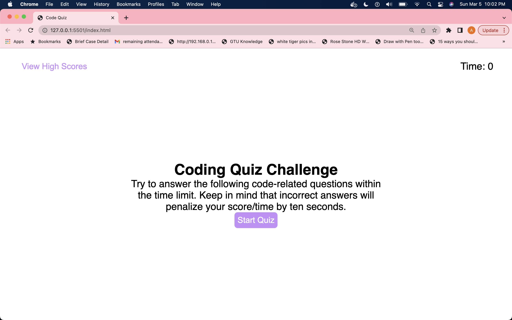
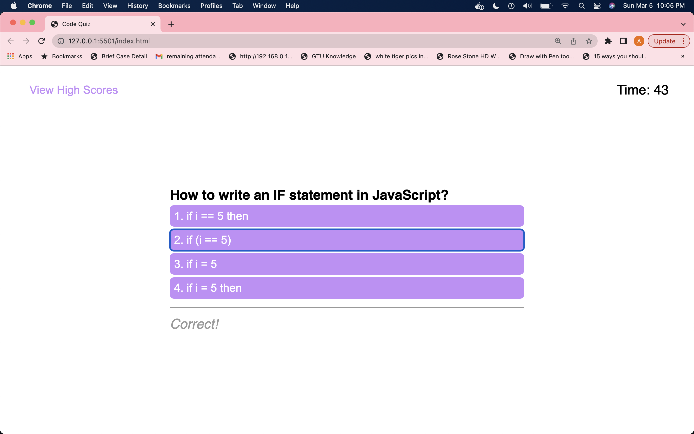
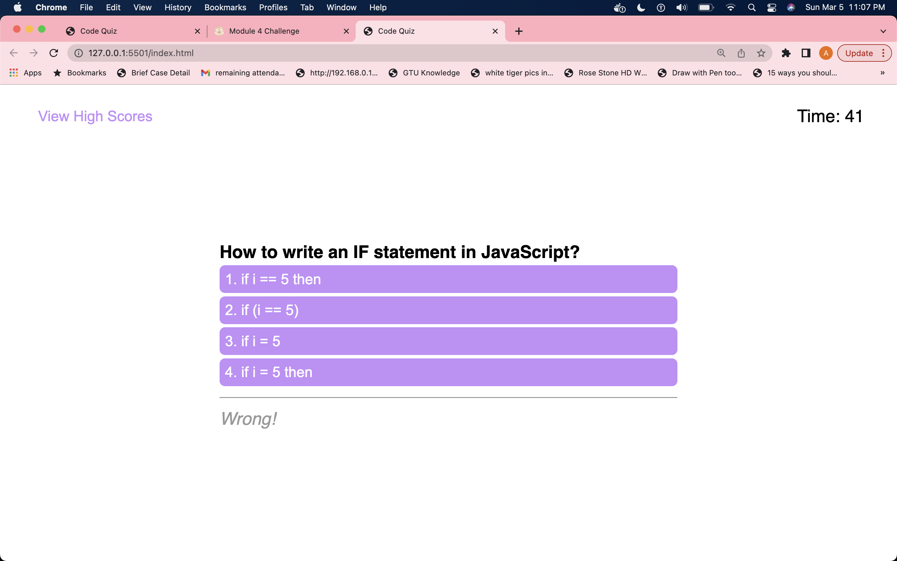
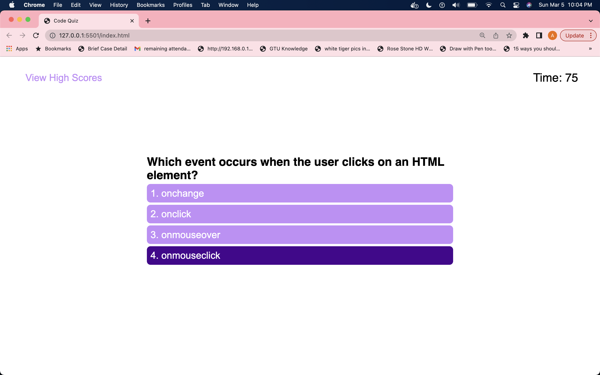
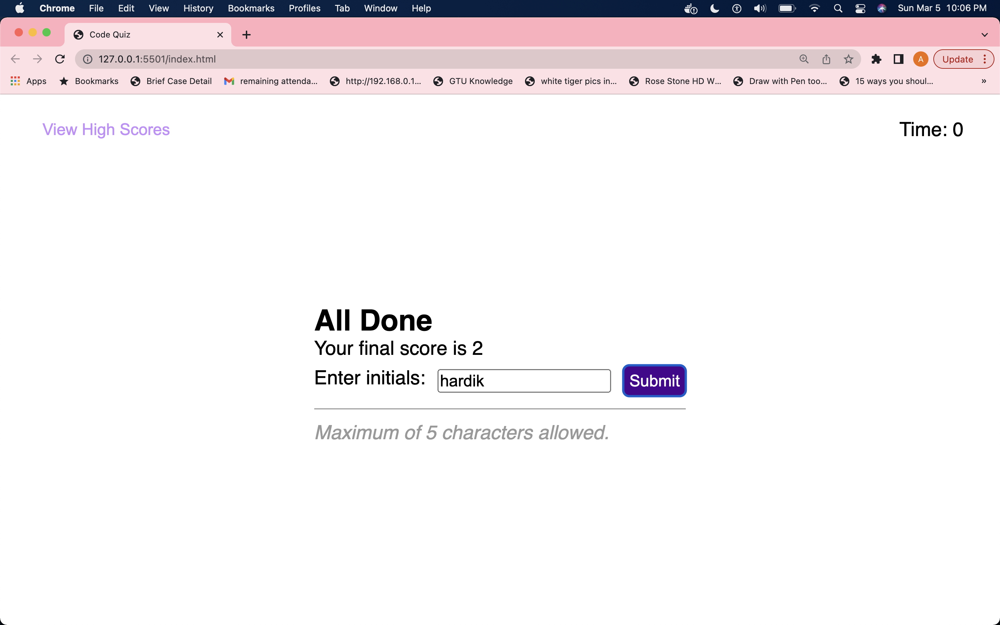
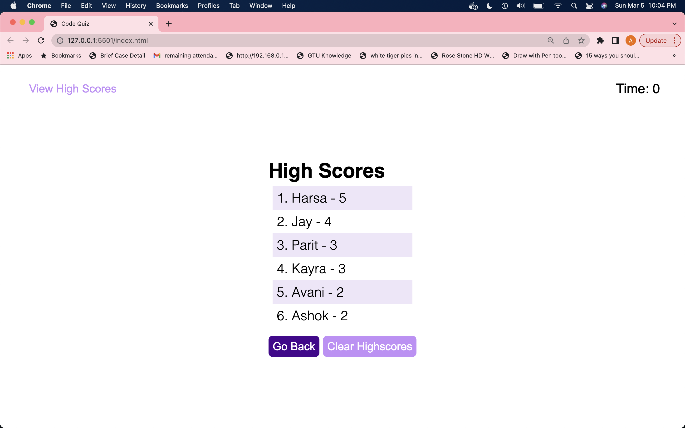

# code-quiz
code quiz to check javascript fundamentals

## Description

This Code Quiz application shows you javascript question with multiple answers and user of this application have to select one answer from four answers.Motivation of this application is as a coding boot camp student, I want to take a timed quiz on javascript fundamentals that stores high scores so that I can gauge my progress compared to my peers.

In This applicaiton first you can see highscore and timer in highscore you can see all participate name(initals) and score. and in timer with initial value zero. also in page its provides some descitptiom of application like if you select wrong answer timer value is decrease by 10 seconds. when you click start quiz button timer display initial value is 75seconds and in this application you can find 5 questions.if you cant solve 5 question is 75seconds and timer reaches zero then also quizing game over.When you select correct answer for question its display correct! and when answer is wrong it display wrong!.so user can also see results when they click answer.for correct answer user score value is increase by 1 initial score value is zero. so everytime when user select correct answer then value is increase by 1 so if all user answer correct then in this code quiz application user score is 5.and when user select wrong anser then in timer its decrease value by 10 seconds for eg. when user select wrong answer that time if timer value is 40 then timer value set 30 because for wrong answer it delets 10 seconds form timer.Game is finish if user answer all 5 questions or timer reaches at zero. then page display final score of user and also in textbox user have to enter their initals also in this textbox area some validation apply like use have to enter minmumm 1 or maximum 5 characters, only character like Uppercase A-Z and lowercase a-z allow,etc.when user click submit button then user can see all other user name and their score.then here go back button again starts quiz and clear highscore button clear all user initals and score value.so from this application user can improve their javascript knoweldge and also see other user quiz results.

so I built this application in which I can test my javascript knowledge with multiple question answers format also I use HTML, CSS, and javascript so it improves my coding skill as well.

## Installation

N/A

## Usage

TO use this code-quiz application, you can see javascript question with multiple answers.So you can improve your javascript knowledge also in this user can see others user result with their initials so you can compare your results with others participates.I attached few screenshots of code-quiz applicatio here and github repository link and deployed link of this applicaiton.

1) The URL of code-quiz deployed application -

2) The URL of the code-quiz GitHub repository -

Here you can see screenshots of code-quiz website.

## Credits
N/A

## License
Please refer to the LICENSE in the repo.

